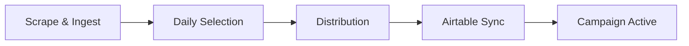

## Overview

The `/api/daily-selection` endpoint creates a new campaign and selects up to `(NUM_VA_TABLES × profiles_per_table)` unused profiles from the `global_usernames` table, marking them as used.

This endpoint is the first step in the daily campaign workflow, followed by distribution and Airtable sync.

## Endpoint

```
POST /api/daily-selection
```

## Authentication

Requires a valid `base_id` to be passed via:
- **Header**: `X-Base-Id: appXYZ123ABC`
- **Request Body**: `{ "base_id": "appXYZ123ABC" }`

<Note>
The header takes precedence over the body parameter if both are provided.
</Note>

## Request Parameters

### Headers

<ParamField header="X-Base-Id" type="string" required>
  Airtable base ID for multi-tenant isolation. Must start with `app` followed by alphanumeric characters.
</ParamField>

<ParamField header="Content-Type" type="string" default="application/json">
  Must be `application/json`
</ParamField>

### Body

<ParamField body="campaign_date" type="string">
  Campaign date in ISO format (YYYY-MM-DD). Defaults to today if not provided.
  
  **Example**: `"2025-10-02"`
</ParamField>

<ParamField body="profiles_per_table" type="integer" required>
  Number of profiles to assign per VA table. This should match your client's `NEXT_PUBLIC_PROFILES_PER_TABLE` configuration.
  
  **Default**: `180` (if not provided, server uses fallback)
  
  **Validation**: Must be a positive integer
</ParamField>

<ParamField body="base_id" type="string">
  Airtable base ID (optional if provided via header)
</ParamField>

## Response

<ResponseField name="success" type="boolean" required>
  Indicates whether the operation completed successfully
</ResponseField>

<ResponseField name="campaign_id" type="string" required>
  UUID of the newly created campaign
</ResponseField>

<ResponseField name="base_id" type="string" required>
  The base_id used for this operation
</ResponseField>

<ResponseField name="total_selected" type="integer" required>
  Total number of profiles selected for this campaign
</ResponseField>

<ResponseField name="campaign_date" type="string" required>
  The campaign date in ISO format (YYYY-MM-DD)
</ResponseField>

## Example Request

```bash
curl -X POST https://api.example.com/api/daily-selection \
  -H "Content-Type: application/json" \
  -H "X-Base-Id: appXYZ123ABC" \
  -d '{
    "campaign_date": "2025-10-15",
    "profiles_per_table": 180
  }'
```

## Example Response

```json
{
  "success": true,
  "campaign_id": "550e8400-e29b-41d4-a716-446655440000",
  "base_id": "appXYZ123ABC",
  "total_selected": 14400,
  "campaign_date": "2025-10-15"
}
```

<Info>
With 80 VA tables and 180 profiles per table, the system will select 14,400 profiles total.
</Info>

## Error Responses

### No Unused Profiles Available

```json
{
  "success": false,
  "error": "No unused profiles available in global_usernames for base_id=appXYZ123ABC"
}
```

**Status Code:** `400 Bad Request`

<Warning>
This error indicates you need to ingest more profiles before running a new campaign. Use the `/api/ingest` endpoint to add more profiles.
</Warning>

### Invalid Base ID Format

```json
{
  "success": false,
  "error": "Invalid base_id format: xyz123"
}
```

**Status Code:** `400 Bad Request`

### Invalid profiles_per_table

```json
{
  "success": false,
  "error": "profiles_per_table must be a positive integer"
}
```

**Status Code:** `400 Bad Request`

### Server Error

```json
{
  "success": false,
  "error": "Database connection failed"
}
```

**Status Code:** `500 Internal Server Error`

## Behavior Details

### Campaign Creation

1. Generates a new UUID for the campaign
2. Creates a campaign record with:
   - `campaign_date`: The specified or default date
   - `total_assigned`: Initially 0, updated after selection
   - `base_id`: For multi-tenant isolation
   - `airtable_base_id`: Same as base_id
   - `status`: Initially `false`, updated to `true` after successful Airtable sync

### Profile Selection

1. **Query**: Selects up to `target_count` profiles WHERE:
   - `used = false`
   - `base_id = {your_base_id}`
   - Ordered by database default (typically creation date)

2. **Mark as Used**: Updates selected profiles:
   - Sets `used = true`
   - Records `used_at` timestamp

3. **Create Assignments**: Inserts records into `daily_assignments` with:
   - `va_table_number = 0` (placeholder, assigned during distribution)
   - `position = 0` (placeholder, assigned during distribution)
   - `status = 'pending'`

### Dynamic VA Table Count

The number of VA tables is determined dynamically by:
1. Checking the database configuration for the base_id
2. Falling back to querying the Airtable base directly
3. Default: 80 tables if not configured

The total profiles selected = `num_va_tables × profiles_per_table`

## Configuration

<Warning>
**IMPORTANT**: Always send `profiles_per_table` from your client.

The server uses a fallback value of 180 if not provided, but this may not match your configuration. Ensure your client sends the actual `NEXT_PUBLIC_PROFILES_PER_TABLE` value.
</Warning>

## Workflow Integration

The daily selection is part of a multi-step workflow:



### Step 1: Daily Selection (This Endpoint)
- Creates campaign
- Selects unused profiles
- Marks profiles as used
- Creates placeholder assignments

### Step 2: Distribution
- Use `/api/distribute/{campaign_id}`
- Shuffles profiles randomly
- Assigns to specific VA tables and positions

### Step 3: Airtable Sync
- Use `/api/airtable-sync/{campaign_id}`
- Pushes assignments to Airtable tables
- Updates campaign status to success

## Multi-Tenant Isolation

All operations are scoped to the provided `base_id`:
- Profiles are selected only from the specified tenant's pool
- Row-Level Security (RLS) ensures data isolation
- Campaign IDs are unique but scoped to base_id in queries

## Usage Notes

<Tip>
**Best Practice**: Run daily selection early in your workflow cycle to ensure fresh profiles are ready before VA teams start work.
</Tip>

<Warning>
Once profiles are marked as `used=true`, they cannot be selected again for future campaigns. Plan your profile pool size accordingly.
</Warning>

## Related Endpoints

- [Ingest Profiles](/api/ingest) - Add new profiles to the pool
- [Distribute Campaign](/api/distribute) - Distribute selected profiles to VA tables
- [Airtable Sync](/api/airtable-sync) - Sync distributed profiles to Airtable
- [Run Daily Pipeline](/api/run-daily) - Run all steps in one orchestrated call
