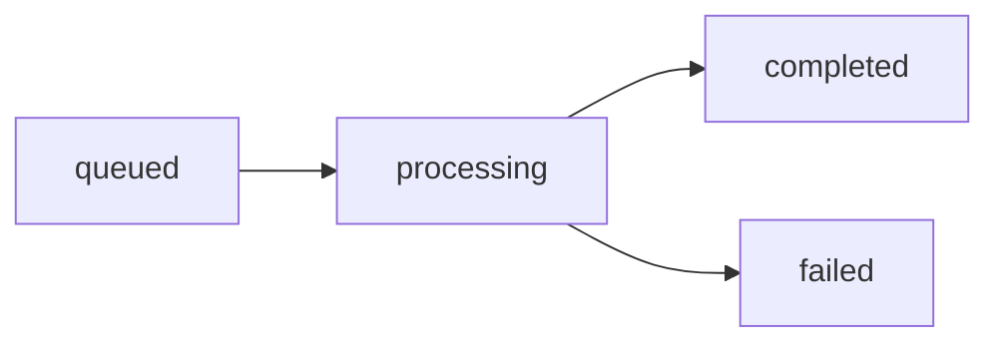

## GET /api/job-status/{job_id}

Retrieve the current status, progress, and metadata for a running or completed scraping job. Use this endpoint to poll for updates while a job is processing.

### Path Parameters

<ParamField path="job_id" type="string" required>
  UUID of the scraping job returned from the `/api/scrape-followers` endpoint.
  
  Format: Standard UUID v4 (e.g., `550e8400-e29b-41d4-a716-446655440000`)
</ParamField>

### Response

<ResponseField name="success" type="boolean" required>
  Indicates whether the status request was successful.
</ResponseField>

<ResponseField name="job_id" type="string" required>
  UUID of the scraping job.
</ResponseField>

<ResponseField name="status" type="string" required>
  Current job status.
  
  Possible values:
  - `"queued"` - Job created and waiting to start
  - `"processing"` - Job is currently running
  - `"completed"` - Job finished successfully
  - `"failed"` - Job encountered an error
</ResponseField>

<ResponseField name="progress" type="number" required>
  Job completion percentage (0.0 to 100.0).
  
  Calculated based on completed batches vs. total batches.
</ResponseField>

<ResponseField name="profiles_scraped" type="integer" required>
  Number of profiles scraped so far (may include filtered profiles).
</ResponseField>

<ResponseField name="total_scraped" type="integer">
  Total raw profiles scraped before filtering (only available after completion).
</ResponseField>

<ResponseField name="total_filtered" type="integer">
  Total profiles after applying gender and other filters (only available after completion).
</ResponseField>

<ResponseField name="total_batches" type="integer" required>
  Total number of account batches for this job.
</ResponseField>

<ResponseField name="current_batch" type="integer" required>
  Number of batches completed so far.
</ResponseField>

<ResponseField name="error_message" type="string">
  Error description if status is `"failed"`, otherwise `null`.
</ResponseField>

<ResponseField name="created_at" type="string" required>
  ISO 8601 timestamp when the job was created.
  
  Format: `YYYY-MM-DDTHH:MM:SS.mmmmmmZ`
</ResponseField>

<ResponseField name="started_at" type="string">
  ISO 8601 timestamp when the job started processing, or `null` if not started.
</ResponseField>

<ResponseField name="completed_at" type="string">
  ISO 8601 timestamp when the job completed, or `null` if still processing.
</ResponseField>

### Example Request

```bash
curl -X GET https://your-api.com/api/job-status/550e8400-e29b-41d4-a716-446655440000
```

### Example Responses

<CodeGroup>
```json 200 Success - Processing
{
  "success": true,
  "job_id": "550e8400-e29b-41d4-a716-446655440000",
  "status": "processing",
  "progress": 45.5,
  "profiles_scraped": 1200,
  "total_scraped": null,
  "total_filtered": null,
  "total_batches": 10,
  "current_batch": 5,
  "error_message": null,
  "created_at": "2026-03-14T10:30:00.000000Z",
  "started_at": "2026-03-14T10:30:05.123456Z",
  "completed_at": null
}
```

```json 200 Success - Completed
{
  "success": true,
  "job_id": "550e8400-e29b-41d4-a716-446655440000",
  "status": "completed",
  "progress": 100.0,
  "profiles_scraped": 5000,
  "total_scraped": 6500,
  "total_filtered": 5000,
  "total_batches": 10,
  "current_batch": 10,
  "error_message": null,
  "created_at": "2026-03-14T10:30:00.000000Z",
  "started_at": "2026-03-14T10:30:05.123456Z",
  "completed_at": "2026-03-14T11:45:30.987654Z"
}
```

```json 200 Success - Queued
{
  "success": true,
  "job_id": "550e8400-e29b-41d4-a716-446655440000",
  "status": "queued",
  "progress": 0.0,
  "profiles_scraped": 0,
  "total_scraped": null,
  "total_filtered": null,
  "total_batches": 5,
  "current_batch": 0,
  "error_message": null,
  "created_at": "2026-03-14T10:30:00.000000Z",
  "started_at": null,
  "completed_at": null
}
```

```json 200 Success - Failed
{
  "success": true,
  "job_id": "550e8400-e29b-41d4-a716-446655440000",
  "status": "failed",
  "progress": 30.0,
  "profiles_scraped": 500,
  "total_scraped": null,
  "total_filtered": null,
  "total_batches": 10,
  "current_batch": 3,
  "error_message": "Apify actor timeout: Request exceeded maximum duration",
  "created_at": "2026-03-14T10:30:00.000000Z",
  "started_at": "2026-03-14T10:30:05.123456Z",
  "completed_at": "2026-03-14T10:45:30.987654Z"
}
```

```json 404 Not Found
{
  "success": false,
  "error": "Job 550e8400-e29b-41d4-a716-446655440000 not found"
}
```

```json 500 Server Error
{
  "success": false,
  "error": "Internal server error message"
}
```
</CodeGroup>

## Polling Best Practices

### Recommended Polling Strategy

1. **Initial delay**: Wait 5-10 seconds after job creation before first poll
2. **Polling interval**: Check status every 10-30 seconds while processing
3. **Timeout**: Set a maximum wait time (e.g., 1-2 hours) based on job size
4. **Exponential backoff**: Increase interval if job is taking longer than expected

### Example Polling Loop (Python)

```python
import time
import requests

def wait_for_job(job_id, max_wait=7200, poll_interval=15):
    """
    Poll job status until completion or timeout.
    
    Args:
        job_id: UUID of the job
        max_wait: Maximum seconds to wait (default 2 hours)
        poll_interval: Seconds between polls (default 15s)
    
    Returns:
        Final job status dictionary
    """
    start_time = time.time()
    
    while time.time() - start_time < max_wait:
        response = requests.get(f"https://api.example.com/api/job-status/{job_id}")
        data = response.json()
        
        if not data["success"]:
            raise Exception(f"Status check failed: {data.get('error')}")
        
        status = data["status"]
        progress = data["progress"]
        
        print(f"Status: {status}, Progress: {progress}%")
        
        if status == "completed":
            return data
        elif status == "failed":
            raise Exception(f"Job failed: {data.get('error_message')}")
        
        time.sleep(poll_interval)
    
    raise TimeoutError(f"Job did not complete within {max_wait} seconds")
```

### Example Polling Loop (JavaScript)

```javascript
async function waitForJob(jobId, maxWait = 7200000, pollInterval = 15000) {
  const startTime = Date.now();
  
  while (Date.now() - startTime < maxWait) {
    const response = await fetch(`https://api.example.com/api/job-status/${jobId}`);
    const data = await response.json();
    
    if (!data.success) {
      throw new Error(`Status check failed: ${data.error}`);
    }
    
    const { status, progress } = data;
    console.log(`Status: ${status}, Progress: ${progress}%`);
    
    if (status === 'completed') {
      return data;
    } else if (status === 'failed') {
      throw new Error(`Job failed: ${data.error_message}`);
    }
    
    await new Promise(resolve => setTimeout(resolve, pollInterval));
  }
  
  throw new Error(`Job did not complete within ${maxWait}ms`);
}
```

## Understanding Progress Calculation

Progress is calculated based on batch completion:

```
progress = (current_batch / total_batches) * 100
```

For example:
- Job with 10 batches
- 5 batches completed
- Progress = (5 / 10) * 100 = 50.0%

<Note>
  Progress updates may not be linear. Some batches may complete faster than others depending on account size and API rate limits.
</Note>

## Status Lifecycle



1. **queued**: Job created, waiting for workers
2. **processing**: Actively scraping profiles
3. **completed**: All batches finished successfully
4. **failed**: Error occurred (check `error_message`)