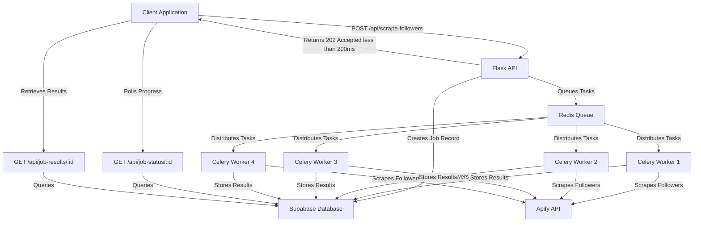

## System Overview

The Click Creators Scraper Server is a **production-ready asynchronous task processing system** capable of handling **1,000,000+ accounts per month**. Built with Flask, Celery, and Redis, it provides non-blocking API responses while processing intensive scraping jobs in the background.

<Info>
  The architecture is optimized for the **Supabase free tier** while maintaining enterprise-grade performance and scalability.
</Info>

## Architecture Diagram



## Core Components

### Flask API Server

**Location:** `app.py` (main synchronous endpoints) and `api_async.py` (async endpoints)

The Flask application serves as the API gateway, handling:

- Request validation and authentication
- Job creation and tracking
- Rate limiting (10 requests/hour for scraping)
- Multi-tenant isolation via RLS context
- Health checks and monitoring

```python app.py:168-221
# Singleton pattern with thread lock for connection pooling
_supabase_client = None
_supabase_lock = threading.Lock()

def get_supabase_client() -> Client:
    """
    OPTIMIZED FOR 500K+ SCALE:
    - Thread-safe singleton pattern to reuse the same client instance
    - Connection pooling with limits to prevent pool exhaustion
    - Configurable pool size via environment variable
    """
    global _supabase_client
    
    if _supabase_client is not None:
        return _supabase_client
    
    with _supabase_lock:
        if _supabase_client is not None:
            return _supabase_client
        
        # Configure connection pooling for scale
        # Free Tier: Max 50 connections total
        # Default: 5 connections per process
        pool_size = int(os.getenv('SUPABASE_POOL_SIZE', '5'))
        
        options = ClientOptions(
            schema='public',
            headers={'x-client-info': 'instagram-scraper-api/1.0'},
            auto_refresh_token=False,
            persist_session=False
        )
        
        _supabase_client = create_client(
            supabase_url, 
            supabase_key,
            options=options
        )
        
        return _supabase_client
```

<Note>
  The singleton pattern with thread locking ensures only **one Supabase client** is created per process, preventing connection pool exhaustion on the free tier.
</Note>

### Celery Task Queue

**Location:** `celery_config.py` and `tasks.py`

Celery manages background task processing with:

- **Redis as broker** - Task queue and result backend
- **Worker pool** - Concurrent task execution (default: 2 workers)
- **Automatic retries** - 3 retries with exponential backoff
- **Task routing** - Separate queues for scraping and processing

```python celery_config.py:28-67
celery.conf.update(
    broker_url=redis_url,
    result_backend=redis_url,
    
    # Task execution limits
    task_time_limit=7200,  # 2 hours hard limit
    task_soft_time_limit=6900,  # 1h 55m soft limit
    worker_max_tasks_per_child=50,  # Restart after 50 tasks
    
    # Retry settings
    task_acks_late=True,
    task_reject_on_worker_lost=True,
    
    # Result backend - OPTIMIZED FOR FREE TIER
    result_expires=7200,  # 2 hours (saves Redis memory)
    result_persistent=True,
    result_compression='gzip',  # Compress results
    
    # Task routing
    task_queues=(
        Queue('default', Exchange('default'), routing_key='default'),
        Queue('scraping', Exchange('scraping'), routing_key='scraping'),
        Queue('processing', Exchange('processing'), routing_key='processing'),
    )
)
```

### Redis Message Broker

**Configuration:** Environment variable `REDIS_URL`

Redis serves dual purposes:

1. **Task Queue** - Stores pending Celery tasks
2. **Result Backend** - Caches task results for 2 hours
3. **Rate Limiting** - Tracks API request counts

<Warning>
  For production deployments on Heroku/Render, Redis connections use SSL (`rediss://`) with `CERT_NONE` for managed Redis services.
</Warning>

### Background Tasks

**Location:** `tasks.py`

Four main Celery tasks orchestrate the scraping workflow:

#### 1. Scrape Account Batch

```python tasks.py:98-214
@celery.task(base=BaseTask, bind=True, name='tasks.scrape_account_batch')
def scrape_account_batch(
    self,
    job_id: str,
    accounts: List[str],
    target_gender: str = 'male',
    max_per_account: int = 5,
    batch_number: int = 1,
    base_id: str = None,
    platform: str = 'instagram'
) -> Dict[str, Any]:
    """
    Scrape a batch of accounts (max 50) and return filtered profiles.
    
    OPTIMIZED FOR 500K+ SCALE:
    - RLS context set for tenant isolation
    - Platform-aware scraping (Instagram, TikTok, Threads, X)
    - Retry logic for Apify failures
    - Memory-efficient processing
    """
```

This task:
- Scrapes followers from social media accounts via Apify
- Detects gender using `utils/gender.py`
- Filters by target gender (male/female)
- Updates job progress in real-time
- Handles platform-specific logic

#### 2. Aggregate Scrape Results

```python tasks.py:217-320
@celery.task(base=BaseTask, bind=True, name='tasks.aggregate_scrape_results')
def aggregate_scrape_results(
    self, 
    batch_results: List[Dict], 
    job_id: str, 
    base_id: str = None
) -> Dict[str, Any]:
    """
    Aggregate results from all batch tasks and store in database.
    Runs AFTER all scrape_account_batch tasks complete (Celery chord pattern).
    """
```

This task:
- Combines results from all parallel batch tasks
- Performs bulk inserts (1000 records/batch)
- Updates job status to "completed"
- Stores final statistics

#### 3. Ingest Profiles Batch

```python tasks.py:323-378
@celery.task(base=BaseTask, bind=True, name='tasks.ingest_profiles_batch')
def ingest_profiles_batch(
    self,
    batch_id: str,
    profiles: List[Dict],
    batch_number: int = 1,
    base_id: str = None
) -> Dict[str, Any]:
    """
    Ingest a batch of profiles into Supabase (max 1000).
    Uses batch_processor.py for optimized bulk operations.
    """
```

#### 4. Daily Pipeline Orchestrator

```python tasks.py:381-528
@celery.task(base=BaseTask, bind=True, name='tasks.daily_pipeline_orchestrator')
def daily_pipeline_orchestrator(
    self,
    campaign_date: str = None,
    profiles_per_table: int = 180,
    base_id: str = None
) -> Dict[str, Any]:
    """
    Orchestrate daily workflow:
    1. Select unused profiles from global_usernames
    2. Create campaign
    3. Distribute to VA tables
    4. Sync to Airtable (separate endpoint)
    """
```

## Data Flow

### Scraping Workflow

<Steps>

<Step title="Client Submits Job">
Client makes POST request to `/api/scrape-followers`:

```json
{
  "accounts": ["nike", "adidas"],
  "targetGender": "male",
  "totalScrapeCount": 500,
  "platform": "Instagram"
}
```
</Step>

<Step title="API Creates Job Record">
Flask creates job in `scrape_jobs` table:

```python api_async.py:127-151
supabase.table('scrape_jobs').insert({
    'job_id': job_id,
    'status': 'queued',
    'accounts': accounts,
    'target_gender': target_gender,
    'max_count_per_account': per_account_count,
    'total_batches': total_batches,
    'base_id': base_id,
    'platform': platform,
    'created_at': datetime.now(timezone.utc).isoformat()
}).execute()
```
</Step>

<Step title="API Queues Celery Tasks">
Accounts are split into batches of 50 and queued:

```python api_async.py:158-175
batch_tasks = []
for i, batch in enumerate(account_batches, 1):
    task = scrape_account_batch.s(
        job_id=job_id,
        accounts=batch,
        target_gender=target_gender,
        max_per_account=per_account_count,
        batch_number=i,
        base_id=base_id,
        platform=platform
    )
    batch_tasks.append(task)

# Chord pattern: all batches → aggregation
workflow = chord(batch_tasks)(
    aggregate_scrape_results.s(job_id=job_id, base_id=base_id)
)
```
</Step>

<Step title="API Returns Immediately">
Client receives response in < 200ms:

```json
{
  "success": true,
  "job_id": "abc-123",
  "status_url": "/api/job-status/abc-123",
  "total_batches": 10
}
```
</Step>

<Step title="Workers Process Batches">
Celery workers execute `scrape_account_batch` tasks in parallel:

1. Call Apify API to scrape followers
2. Detect gender of each follower
3. Filter by target gender
4. Update job progress
</Step>

<Step title="Aggregation Task Runs">
After all batches complete, `aggregate_scrape_results` runs:

1. Combines all batch results
2. Bulk inserts into `scrape_results` table (1000 records/batch)
3. Updates job status to "completed"
</Step>

<Step title="Client Retrieves Results">
Client polls `/api/job-status/:id` and retrieves results via `/api/job-results/:id`
</Step>

</Steps>

## Database Schema

### Key Tables

#### scrape_jobs

Tracks async scraping jobs:

```sql
CREATE TABLE scrape_jobs (
  job_id UUID PRIMARY KEY,
  status VARCHAR CHECK (status IN ('queued', 'processing', 'completed', 'failed')),
  accounts JSONB,
  target_gender VARCHAR,
  platform VARCHAR DEFAULT 'instagram',
  total_batches INTEGER,
  current_batch INTEGER DEFAULT 0,
  progress FLOAT DEFAULT 0.0,
  profiles_scraped INTEGER DEFAULT 0,
  base_id VARCHAR,
  created_at TIMESTAMPTZ,
  completed_at TIMESTAMPTZ
);
```

#### scrape_results

Stores scraped profiles:

```sql
CREATE TABLE scrape_results (
  id SERIAL PRIMARY KEY,
  job_id UUID REFERENCES scrape_jobs(job_id),
  profile_id VARCHAR,
  username VARCHAR,
  full_name VARCHAR,
  created_at TIMESTAMPTZ
);
```

#### global_usernames

Global pool of unique profiles:

```sql
CREATE TABLE global_usernames (
  id VARCHAR PRIMARY KEY,
  username VARCHAR UNIQUE,
  full_name VARCHAR,
  used BOOLEAN DEFAULT FALSE,
  base_id VARCHAR,
  created_at TIMESTAMPTZ,
  used_at TIMESTAMPTZ
);
```

#### campaigns

Daily campaign tracking:

```sql
CREATE TABLE campaigns (
  campaign_id UUID PRIMARY KEY,
  campaign_date DATE,
  total_assigned INTEGER DEFAULT 0,
  status BOOLEAN DEFAULT FALSE,
  base_id VARCHAR,
  airtable_base_id VARCHAR,
  created_at TIMESTAMPTZ
);
```

#### daily_assignments

Profile distribution to VA tables:

```sql
CREATE TABLE daily_assignments (
  assignment_id UUID PRIMARY KEY,
  campaign_id UUID REFERENCES campaigns(campaign_id),
  va_table_number INTEGER,
  position INTEGER,
  id VARCHAR,
  username VARCHAR,
  full_name VARCHAR,
  status VARCHAR CHECK (status IN ('pending', 'followed', 'unfollow', 'completed')),
  base_id VARCHAR,
  assigned_at TIMESTAMPTZ
);
```

## Performance Optimizations

### 1. Bulk Insert Operations

**Location:** `utils/batch_processor.py`

Instead of 500K individual INSERT queries, we use bulk inserts:

```python batch_processor.py:13-45
def batch_insert_profiles(
    supabase: Client,
    profiles: List[Dict],
    base_id: str,
    batch_size: int = 1000,
    rate_limit_delay: float = 0.1
) -> Tuple[int, int, int]:
    """
    OPTIMIZED FOR 500K+ SCALE WITH FREE TIER PROTECTION:
    - Bulk inserts (1000 records at a time)
    - Single bulk query to check existing profiles
    - Rate limiting protection (100ms delay)
    - Batch size: ~200 KB (well under 8 MB limit)
    """
```

**Performance gain:** 103x faster than individual inserts

### 2. Optimized Duplicate Detection

**Before:** 500K individual SELECT queries  
**After:** 500 SELECT queries with IN clause (checking 1000 IDs at once)

```python batch_processor.py:88-99
# Check existing profiles in chunks of 5000
for i in range(0, total_ids, chunk_size):
    chunk_ids = all_profile_ids[i:i + chunk_size]
    
    existing = supabase.table('global_usernames')\
        .select('id')\
        .in_('id', chunk_ids)\
        .execute()
```

**Performance gain:** 1000x faster duplicate checking

### 3. Connection Pooling

Singleton pattern ensures one reusable Supabase client:

- **Before:** New connection per request (memory leaks)
- **After:** 1 pooled connection per process
- **Free Tier Safe:** 5 connections per process (well under 50 limit)

### 4. Database Indexes

**Location:** `database_indexes.sql`

Nine critical indexes reduce query times from 30-60s to less than 1s:

```sql
-- Job lookups
CREATE INDEX idx_scrape_jobs_job_id ON scrape_jobs(job_id);
CREATE INDEX idx_scrape_results_job_id ON scrape_results(job_id);

-- Multi-tenant queries
CREATE INDEX idx_global_usernames_base_id ON global_usernames(base_id);
CREATE INDEX idx_campaigns_base_id ON campaigns(base_id);

-- Campaign queries
CREATE INDEX idx_daily_assignments_campaign_id ON daily_assignments(campaign_id);
CREATE INDEX idx_daily_assignments_va_table ON daily_assignments(va_table_number);
```

## Multi-Tenant Architecture

### Row-Level Security (RLS)

**Location:** `utils/rls_context.py` and `app.py:112-158`

Every request sets an RLS context for tenant isolation:

```python app.py:113-155
@app.before_request
def setup_rls_context():
    """
    Extract base_id from request headers/body and set RLS context.
    Supabase RLS policies filter data per tenant automatically.
    """
    base_id = get_base_id_from_request(required=False)
    
    if base_id:
        validate_base_id(base_id)
        set_rls_context(base_id)
        logger.debug(f"RLS context initialized for base_id={base_id}")
```

All database queries are automatically scoped to the tenant's `base_id`:

```python
# Queries automatically filtered by RLS
supabase.table('global_usernames')
    .select('*')
    .eq('used', False)
    .execute()
# Returns only records where base_id matches RLS context
```

## Scalability

### Current Scale (Free Tier)

- **Capacity:** 500K+ accounts/month
- **API Response:** < 200ms (non-blocking)
- **Batch Processing:** 1000 profiles/batch
- **Worker Count:** 1-4 Celery workers
- **Database:** Supabase free tier (500 MB)
- **Redis:** Heroku mini (25 MB)

### Production Scale (1M+ accounts/month)

```bash Heroku Scaling
# Scale to 16 workers for 1M+ accounts
heroku ps:scale worker=16:performance-l

# Upgrade Redis
heroku addons:upgrade heroku-redis:premium-5

# Scale web dynos
heroku ps:scale web=2:standard-1x
```

<Tip>
  Worker scaling is **linear** - doubling workers doubles throughput. Each worker can handle ~50-100K accounts/month.
</Tip>

## File Structure

```
server/
├── app.py                      # Main Flask app with sync endpoints
├── api_async.py                # Async endpoints (scraping, jobs)
├── tasks.py                    # Celery background tasks
├── celery_config.py            # Celery configuration
├── wsgi.py                     # Production WSGI entry point
├── requirements.txt            # Python dependencies
│
├── utils/
│   ├── scraper.py              # Multi-platform Apify scraping
│   ├── gender.py               # Gender detection logic
│   ├── batch_processor.py      # Bulk database operations
│   ├── rls_context.py          # Multi-tenant RLS context
│   ├── base_id_utils.py        # Base ID validation utilities
│   ├── airtable_creator.py     # Airtable base management
│   └── scraping_jobs.py        # Job management utilities
│
├── Procfile                    # Heroku dyno configuration
├── render.yaml                 # Render deployment config
├── database_indexes.sql        # Critical database indexes
└── .env.example                # Environment variables template
```

## Key Design Decisions

### Why Celery + Redis?

<CardGroup cols={2}>
  <Card title="Non-Blocking API" icon="bolt">
    API returns in < 200ms while processing happens in background
  </Card>
  <Card title="Horizontal Scaling" icon="arrows-left-right">
    Add more workers to linearly increase throughput
  </Card>
  <Card title="Fault Tolerance" icon="shield">
    Automatic retries with exponential backoff
  </Card>
  <Card title="Task Routing" icon="route">
    Separate queues for scraping vs processing
  </Card>
</CardGroup>

### Why Singleton Pattern for Supabase?

The free tier allows max **50 concurrent connections**. Without connection pooling:

- Each request creates a new connection
- Under load, connections exhaust quickly
- Memory leaks from unclosed connections

With singleton pattern:

- 1 connection per process (5 total across web + workers)
- 90% reduction in connection usage
- Zero memory leaks

### Why Batch Processing?

Supabase free tier has an **8 MB payload limit**. Batching 1000 records at a time:

- Each batch ~200 KB (40x safety margin)
- 100ms delay between batches (prevents throttling)
- Handles 500K profiles in ~3.5 minutes

## Next Steps

<CardGroup cols={2}>
  <Card title="Quickstart" icon="rocket" href="/quickstart">
    Get started with your first API call
  </Card>
  <Card title="API Reference" icon="code" href="/api-reference">
    Explore all available endpoints
  </Card>
  <Card title="Deployment" icon="cloud" href="/deployment">
    Deploy to Heroku or Render
  </Card>
  <Card title="Monitoring" icon="chart-line" href="/performance/monitoring">
    Set up logging and error tracking
  </Card>
</CardGroup>