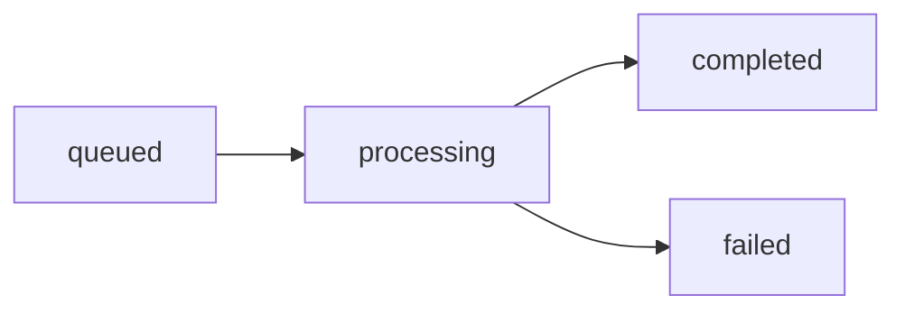

The Click Creators Scraper Server uses a comprehensive job tracking system to monitor asynchronous scraping operations. This guide covers job lifecycle, status monitoring, and result retrieval.

## Job Lifecycle

Every scraping operation creates a job record that progresses through distinct states:



### Job States

<AccordionGroup>
  <Accordion title="queued" icon="clock">
    Initial state when job is created but not yet started.
    
    - Job record exists in database
    - Celery tasks not yet dispatched
    - Duration: Typically < 1 second
  </Accordion>
  
  <Accordion title="processing" icon="spinner">
    Job is actively running with Celery workers processing batches.
    
    - Batch tasks executing in parallel
    - Progress updates as batches complete
    - Apify scraping in progress
    - Duration: 30 seconds to several minutes depending on account count
  </Accordion>
  
  <Accordion title="completed" icon="check">
    All batches finished successfully and results aggregated.
    
    - Results available in `scrape_results` table
    - Final metrics calculated (total_scraped, total_filtered)
    - Ready for retrieval via `/api/job-results/{job_id}`
  </Accordion>
  
  <Accordion title="failed" icon="xmark">
    Job encountered an unrecoverable error.
    
    - Error message stored in `error_message` field
    - May be partial results from successful batches
    - Check logs for detailed error information
  </Accordion>
</AccordionGroup>

## Job Status Endpoint

Use the job status endpoint to monitor progress in real-time:

### Request

```bash
GET /api/job-status/{job_id}
```

### Example

```bash
curl https://your-server.com/api/job-status/a1b2c3d4-e5f6-7890-abcd-ef1234567890
```

### Response Schema

```json
{
  "success": true,
  "job_id": "a1b2c3d4-e5f6-7890-abcd-ef1234567890",
  "status": "processing",
  "progress": 45.5,
  "profiles_scraped": 68,
  "total_scraped": 150,
  "total_filtered": 68,
  "total_batches": 3,
  "current_batch": 2,
  "error_message": null,
  "created_at": "2026-03-14T10:30:00.000Z",
  "started_at": "2026-03-14T10:30:02.000Z",
  "completed_at": null
}
```

### Response Fields

| Field | Type | Description |
|-------|------|-------------|
| `success` | boolean | Whether the API request succeeded |
| `job_id` | string | Unique job identifier (UUID) |
| `status` | string | Current job state: `queued`, `processing`, `completed`, or `failed` |
| `progress` | number | Percentage complete (0.0 to 100.0) |
| `profiles_scraped` | integer | Number of profiles scraped so far |
| `total_scraped` | integer | Total raw profiles from Apify (all genders) |
| `total_filtered` | integer | Profiles after gender filtering |
| `total_batches` | integer | Total number of account batches |
| `current_batch` | integer | Currently processing batch number |
| `error_message` | string\|null | Error description if status is `failed` |
| `created_at` | string | ISO timestamp when job was created |
| `started_at` | string\|null | ISO timestamp when processing began |
| `completed_at` | string\|null | ISO timestamp when job finished |

## Implementation Details

The status endpoint is defined in `api_async.py`:

```python api_async.py
@app.route('/api/job-status/<job_id>', methods=['GET'])
def get_job_status(job_id: str):
    """
    Get status of a scraping job.
    """
    try:
        supabase = get_supabase_client()
        
        # Query job
        job = supabase.table('scrape_jobs')\
            .select('*')\
            .eq('job_id', job_id)\
            .execute()
        
        if not job.data or len(job.data) == 0:
            return jsonify({
                'success': False,
                'error': f'Job {job_id} not found'
            }), 404
        
        job_data = job.data[0]
        
        return jsonify({
            'success': True,
            'job_id': job_id,
            'status': job_data['status'],
            'progress': float(job_data['progress']) if job_data['progress'] else 0.0,
            'profiles_scraped': job_data['profiles_scraped'],
            'total_scraped': job_data.get('total_scraped'),
            'total_filtered': job_data.get('total_filtered'),
            'total_batches': job_data.get('total_batches', 0),
            'current_batch': job_data.get('current_batch', 0),
            'error_message': job_data.get('error_message'),
            'created_at': job_data['created_at'],
            'started_at': job_data.get('started_at'),
            'completed_at': job_data.get('completed_at')
        })
        
    except Exception as e:
        logger.error(f"Error fetching job status: {str(e)}")
        return jsonify({
            'success': False,
            'error': str(e)
        }), 500
```

## Progress Tracking

Progress is updated incrementally as batch tasks complete:

### During Batch Execution

Each `scrape_account_batch` task updates the `profiles_scraped` count:

```python tasks.py
# From tasks.py:166-183
try:
    # Increment profiles_scraped count
    job = supabase.table('scrape_jobs')\
        .select('profiles_scraped')\
        .eq('job_id', job_id)\
        .execute()
    
    current_count = job.data[0]['profiles_scraped'] if job.data else 0
    new_count = current_count + len(complete_profiles)
    
    supabase.table('scrape_jobs')\
        .update({
            'profiles_scraped': new_count,
            'updated_at': datetime.now(timezone.utc).isoformat()
        })\
        .eq('job_id', job_id)\
        .execute()
except Exception as e:
    logger.warning(f"Failed to update job progress: {str(e)}")
```

### After Aggregation

The `aggregate_scrape_results` task sets final status and metrics:

```python tasks.py
# From tasks.py:280-291
supabase.table('scrape_jobs')\
    .update({
        'status': 'completed',
        'total_scraped': total_scraped,
        'total_filtered': total_filtered,
        'profiles_scraped': len(all_profiles),
        'progress': 100.0,
        'completed_at': datetime.now(timezone.utc).isoformat(),
        'updated_at': datetime.now(timezone.utc).isoformat()
    })\
    .eq('job_id', job_id)\
    .execute()
```

## Polling Best Practices

<Steps>
  <Step title="Start with Short Intervals">
    Begin polling every 2-3 seconds during the `processing` state to catch quick completions.
  </Step>
  
  <Step title="Implement Exponential Backoff">
    If job is still processing after 30 seconds, increase polling interval to 5-10 seconds to reduce load.
    
    ```javascript
    let pollInterval = 2000; // Start at 2 seconds
    const maxInterval = 10000; // Max 10 seconds
    
    const poll = async () => {
      const status = await checkJobStatus(jobId);
      
      if (status.status === 'processing') {
        pollInterval = Math.min(pollInterval * 1.5, maxInterval);
        setTimeout(poll, pollInterval);
      } else if (status.status === 'completed') {
        // Fetch results
      } else if (status.status === 'failed') {
        // Handle error
      }
    };
    ```
  </Step>
  
  <Step title="Set Timeout Limits">
    Implement a maximum wait time (e.g., 5 minutes) to prevent infinite polling on stuck jobs.
  </Step>
  
  <Step title="Handle Network Errors">
    Retry failed status checks with exponential backoff before giving up.
  </Step>
</Steps>

<Note>
  Most jobs complete within 30-90 seconds for typical workloads (3-10 accounts, 50-200 followers each).
</Note>

## Result Retrieval

Once a job reaches `completed` status, retrieve results using the results endpoint:

### Request

```bash
GET /api/job-results/{job_id}?page=1&limit=1000
```

### Query Parameters

| Parameter | Type | Default | Max | Description |
|-----------|------|---------|-----|-------------|
| `page` | integer | 1 | - | Page number for pagination |
| `limit` | integer | 1000 | 5000 | Results per page |

### Example

```bash
curl "https://your-server.com/api/job-results/a1b2c3d4-e5f6-7890-abcd-ef1234567890?page=1&limit=1000"
```

### Response

```json
{
  "success": true,
  "job_id": "a1b2c3d4-e5f6-7890-abcd-ef1234567890",
  "page": 1,
  "limit": 1000,
  "total": 5432,
  "profiles": [
    {
      "id": "123456789",
      "username": "john_doe",
      "full_name": "John Doe",
      "created_at": "2026-03-14T10:35:12.000Z"
    },
    {
      "id": "987654321",
      "username": "jane_smith",
      "full_name": "Jane Smith",
      "created_at": "2026-03-14T10:35:13.000Z"
    }
  ]
}
```

### Pagination Example

<CodeGroup>
```python Python
import requests

def fetch_all_results(job_id, base_url):
    all_profiles = []
    page = 1
    limit = 1000
    
    while True:
        response = requests.get(
            f"{base_url}/api/job-results/{job_id}",
            params={"page": page, "limit": limit}
        )
        data = response.json()
        
        if not data["success"]:
            raise Exception(data["error"])
        
        all_profiles.extend(data["profiles"])
        
        # Check if we've fetched all pages
        if len(all_profiles) >= data["total"]:
            break
        
        page += 1
    
    return all_profiles

profiles = fetch_all_results(
    "a1b2c3d4-e5f6-7890-abcd-ef1234567890",
    "https://your-server.com"
)
print(f"Fetched {len(profiles)} total profiles")
```

```javascript JavaScript
async function fetchAllResults(jobId, baseUrl) {
  const allProfiles = [];
  let page = 1;
  const limit = 1000;
  
  while (true) {
    const response = await fetch(
      `${baseUrl}/api/job-results/${jobId}?page=${page}&limit=${limit}`
    );
    const data = await response.json();
    
    if (!data.success) {
      throw new Error(data.error);
    }
    
    allProfiles.push(...data.profiles);
    
    // Check if we've fetched all pages
    if (allProfiles.length >= data.total) {
      break;
    }
    
    page++;
  }
  
  return allProfiles;
}

const profiles = await fetchAllResults(
  "a1b2c3d4-e5f6-7890-abcd-ef1234567890",
  "https://your-server.com"
);
console.log(`Fetched ${profiles.length} total profiles`);
```
</CodeGroup>

## Error Handling

### Job Not Found (404)

```json
{
  "success": false,
  "error": "Job a1b2c3d4-e5f6-7890-abcd-ef1234567890 not found"
}
```

**Causes:**
- Invalid job ID
- Job expired (if cleanup policies are active)
- Typo in job ID

### Job Not Completed (400)

Attempting to fetch results before job completes:

```json
{
  "success": false,
  "error": "Job is not completed yet (status: processing)"
}
```

**Solution:** Continue polling `/api/job-status` until status is `completed`

### Failed Jobs

Jobs in `failed` state include error details:

```json
{
  "success": true,
  "job_id": "a1b2c3d4-e5f6-7890-abcd-ef1234567890",
  "status": "failed",
  "error_message": "Failed to scrape followers after 3 attempts: Connection timeout",
  "progress": 33.3,
  "profiles_scraped": 25,
  "created_at": "2026-03-14T10:30:00.000Z",
  "started_at": "2026-03-14T10:30:02.000Z",
  "completed_at": null
}
```

<Warning>
  Failed jobs may have partial results. Check `profiles_scraped` to see if any batches succeeded before failure.
</Warning>

## Database Schema

The `scrape_jobs` table stores all job metadata:

```sql
CREATE TABLE scrape_jobs (
  job_id UUID PRIMARY KEY,
  status TEXT NOT NULL,  -- 'queued', 'processing', 'completed', 'failed'
  accounts TEXT[] NOT NULL,
  target_gender TEXT,
  max_count_per_account INTEGER,
  total_batches INTEGER,
  current_batch INTEGER,
  progress NUMERIC(5,2),
  profiles_scraped INTEGER DEFAULT 0,
  total_scraped INTEGER,
  total_filtered INTEGER,
  base_id TEXT NOT NULL,
  platform TEXT DEFAULT 'instagram',
  error_message TEXT,
  created_at TIMESTAMPTZ DEFAULT NOW(),
  started_at TIMESTAMPTZ,
  completed_at TIMESTAMPTZ,
  updated_at TIMESTAMPTZ DEFAULT NOW()
);
```

## Next Steps

<CardGroup cols={2}>
  <Card title="Scraping Workflow" icon="diagram-project" href="/guides/scraping-workflow">
    Understand the complete scraping process
  </Card>
  <Card title="Batch Processing" icon="layer-group" href="/guides/batch-processing">
    Learn about batch operations and optimization
  </Card>
  <Card title="Multi-Platform Support" icon="globe" href="/guides/multi-platform-support">
    Configure scraping for different platforms
  </Card>
  <Card title="API Reference" icon="code" href="/api-reference">
    Complete API endpoint documentation
  </Card>
</CardGroup>